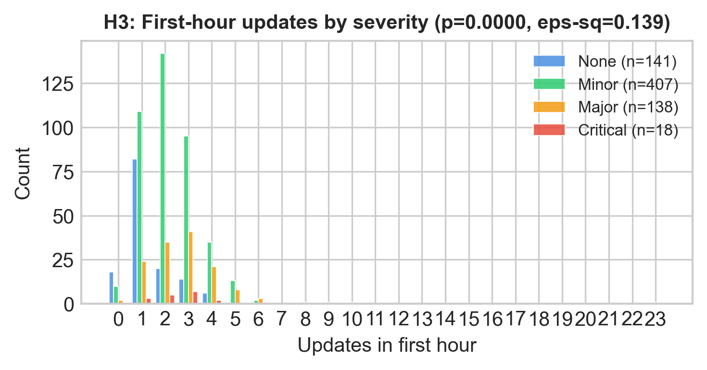
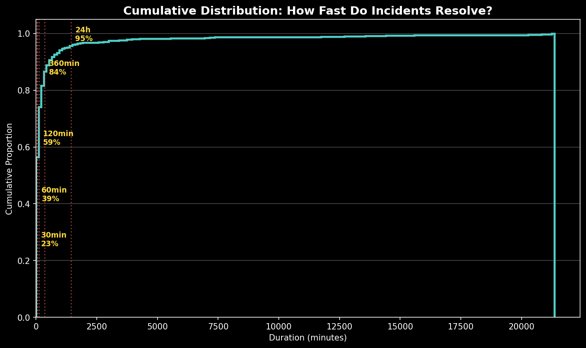
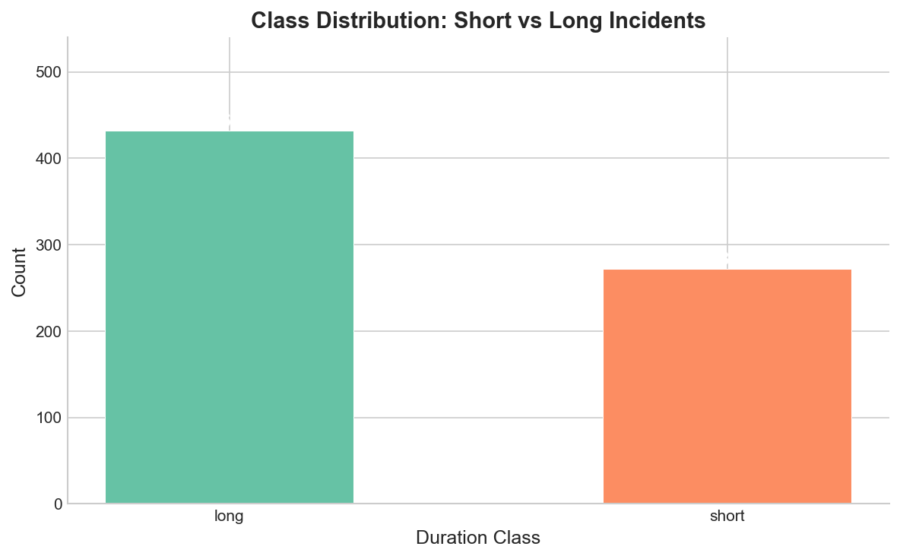
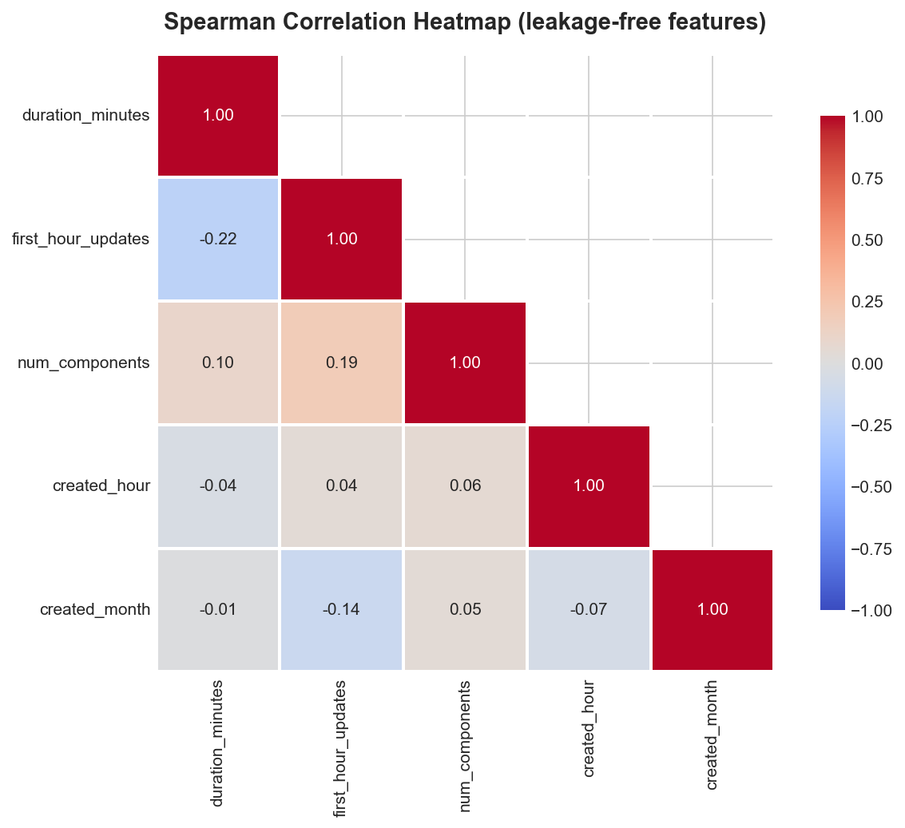
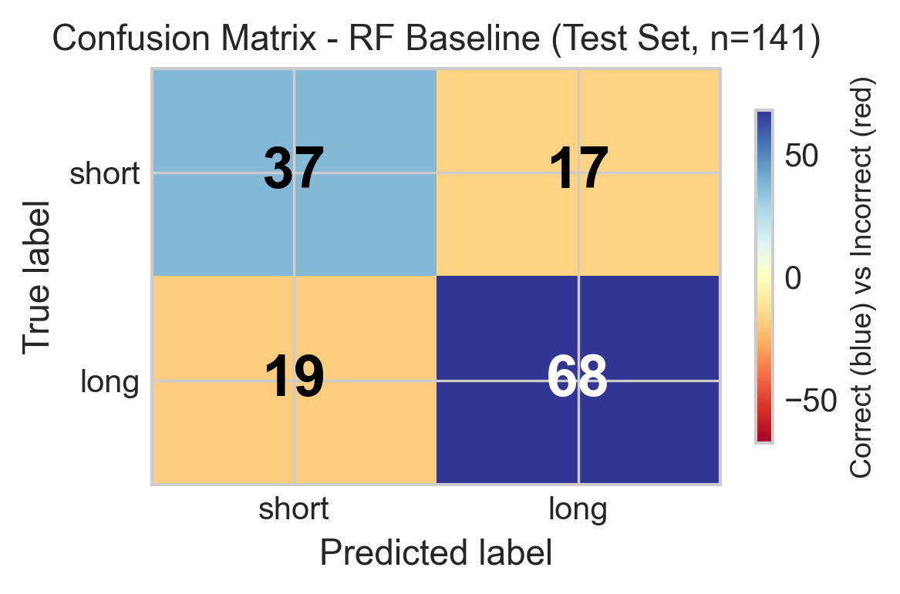
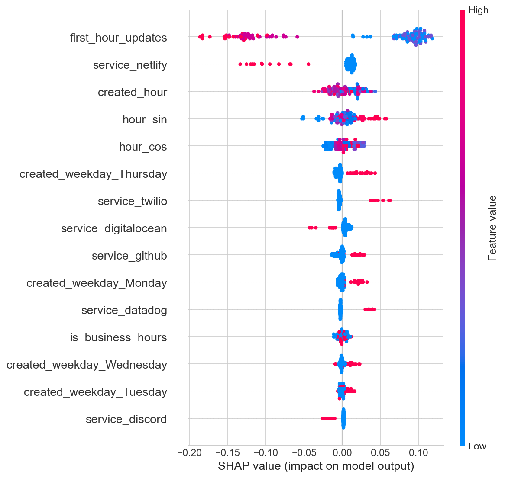

# DSA210 Term Project — Incident Genome

Cloud service outage pattern analysis.

---

## How to grade this project

**Quick start (after `final` tag is pushed):**

```bash
git clone https://github.com/alperkilic1/dsa210-term-project.git
cd dsa210-term-project
git checkout final
```

**Recommended reading order:**

| Order | File | Purpose |
|-------|------|---------|
| 1 | `final_report.html` (or `.pdf`) | Design-polished final report (same content as below) |
| 2 | `final_report.md` | Markdown source — ~3800-word report with all sections |
| 3 | `eda_report.ipynb` | EDA analysis (14 sections, all outputs committed) |
| 4 | `ml_baseline.ipynb` | Model training (15 cells executed, outputs visible) |
| 5 | `data/` | Raw JSON + processed CSV (704 incidents) |
| 6 | `figures/` | 19 PNGs (16 EDA + 3 ML) |

**Reproducibility:**

```bash
python3 -m venv .venv && source .venv/bin/activate
pip install -r requirements.txt
jupyter execute eda_report.ipynb ml_baseline.ipynb
```

Both notebooks run end-to-end in under 60 seconds (given `data/incidents.json`).

---

## Grading rubric self-check

| Criterion | Status | Evidence |
|-----------|--------|----------|
| Statistical analysis | Done | 3 hypothesis tests with BH correction, Cliff's delta, epsilon-squared, bootstrap CI (Sec 4.4) |
| Multiple ML models | Done | Logistic Regression + Random Forest (baseline) + Random Forest (GridSearchCV-tuned) (Sec 5.4) |
| Cross-validation | Done | 5-fold StratifiedKFold, per-fold metrics reported (Sec 6.4) |
| Feature engineering | Done | Time-windowed `first_hour_updates`, cyclic hour encoding, leakage-free design (Sec 5.1) |
| Class imbalance handled | Done | `class_weight='balanced'`, stratified splits, SMOTE considered and rejected with justification (Sec 5.5) |
| SHAP interpretability | Done | Top-5 features, `first_hour_updates` dominates by 5-6x (Sec 6.3) |
| Limitations discussed | Done | 8 limitations + post-feedback revisions (Sec 8) |
| Outlier treatment | Done | IQR flagging, retain with justification (Sec 4.5) |
| Data leakage addressed | Done | `num_updates` sign-flip discovery, replaced with time-windowed feature (Sec 4.6) |
| Naive baseline comparison | Done | RF beats majority-class by +12.8pp accuracy, +0.35 F1-macro (Sec 6.1) |
| Statistical significance | Done | Binomial test p = 6.67 x 10^-4 (Sec 6.1) |

---

## Data flow

```
raw JSON (869 incidents, 14 services)
    |
    v
clean CSV (704 resolved, feature-enriched)
    |
    v
EDA (distribution, temporal, hypothesis tests, outlier flagging)
    |
    v
feature engineering (first_hour_updates, cyclic hour, leakage exclusions)
    |
    v
stratified 80/20 train/test split
    |
    v
model training (LR + RF + GridSearchCV tuning, class_weight='balanced')
    |
    v
evaluation (accuracy, F1-macro, confusion matrix, binomial test)
    |
    v
SHAP interpretation (TreeExplainer, top-5 features)
```

---

**Course:** DSA210 Introduction to Data Science, Spring 2026
**Author:** Alper Kılıç
**Instructors:** Öznur Taştan, Özgür Asar

## Research question

> Using only features that are observable within the first hour of an incident (service, start-hour, day-of-week, first-hour update count, severity at t=0), can we tell whether an outage will be short (< 60 min) or long (≥ 60 min)?

Repo covers two milestones: the EDA milestone (`milestone1` tag) and the supervised-classifier ML milestone (commits after the tag, head-of-`main`).

## ML milestone summary (5 May)

| Item | Value |
|---|---|
| Models compared | Logistic Regression, Random Forest (baseline), Random Forest (GridSearchCV-tuned) |
| Test accuracy (RF baseline) | 0.7447 |
| Test F1-macro (RF baseline) | 0.7317 |
| 5-fold CV F1-macro (RF baseline) | 0.6412 ± 0.0370 |
| Naive baseline (always-long) | 0.617 — beaten by +12.8pp absolute |
| Top SHAP feature | `first_hour_updates` (mean \|SHAP\| = 0.103, ~5–6× the next feature) |

Full write-up: [`final_report.md`](final_report.md) · notebook: [`ml_baseline.ipynb`](ml_baseline.ipynb) · raw metrics: [`data/ml_results.json`](data/ml_results.json).

## What I did

- Scraped 869 raw incidents from 14 public cloud status pages (GitHub, Cloudflare, OpenAI, Discord, Reddit, Atlassian, Vercel, Netlify, DigitalOcean, Dropbox, Linear, Notion, Twilio, Datadog) via their Statuspage.io API endpoints. Data spans 2019-05-07 to 2026-04-11 (~83 months), though most services only expose their last 12–24 months.
- Cleaned down to 704 resolved incidents with valid duration (dropped 158 unresolved/scheduled-maintenance, 7 with negative duration).
- Flagged 84 outliers with IQR (kept them, didn't drop).
- Discovered and fixed a data leak: the original `num_updates` ↔ duration correlation (Spearman ρ=+0.46) collapses and *flips sign* (ρ=−0.224) once you restrict to updates posted within the first 3600s — the original signal was post-resolution updates inflating the count for long incidents. Built a leakage-free feature `first_hour_updates` and a side-by-side comparison plot to show the artifact.
- 16 EDA figures + 3 ML figures, 3 hypothesis tests with BH-corrected p-values and effect sizes, bootstrap 95% CI for median duration.

## Key findings

| Question | Result |
|---|---|
| What's a typical outage duration? | median **82.5 min**, bootstrap 95% CI **[73.2, 91.3]** — heavy right tail, mean 480 min |
| Does severity predict first-hour update activity? (H3) | **Yes**. Kruskal-Wallis H=100.6, p≈0, BH-adjusted q≈0, ε²=0.139 (medium effect). Dunn post-hoc: `none` differs from all other groups; `major` vs `minor` also significant. |
| Do business-hours incidents resolve faster? (H1) | **No**. Mann-Whitney U, raw p=0.367, BH q=0.550, Cliff's δ=-0.039 (negligible). |
| Do weekend incidents resolve differently? (H2) | **No**. Mann-Whitney U, raw p=0.878, BH q=0.878, Cliff's δ=-0.015 (negligible). |
| Was the `num_updates`-vs-duration correlation real? | **No**. Leaky version: Spearman ρ≈+0.46. Clean (`first_hour_updates`): Spearman ρ=-0.224 — sign flips and magnitude halves. The original "correlation" was mostly post-resolution updates inflating the count. |
| How imbalanced is the short/long target? | 272 short vs 432 long, 1.59:1 — mild. Stratified split + `class_weight='balanced'` demonstrated in §7a. |














## Instructor-feedback addressed

| Proposal concern | How it's addressed |
|---|---|
| Data leakage | `num_updates` replaced by `first_hour_updates` everywhere hypothesis tests and the heatmap use it. Side-by-side comparison in §10. `impact` and `num_components` also flagged as leaky and excluded from the ML feature set. |
| Outliers | IQR flag kept but not dropped (§2). Day-of-week averages (§5e) exclude flagged outliers. Duration figures use log axes so the tail doesn't dominate. |
| Class imbalance | Visualized in §7 with ratio printout. §7a demonstrates stratified 80/20 split and `compute_class_weight('balanced')` output for the ML milestone. |

## Repo map

| Path | What's inside |
|---|---|
| `eda_report.ipynb` | EDA notebook (milestone1), 14 sections, 29 code cells, all outputs committed |
| `ml_baseline.ipynb` | ML notebook (5 May milestone), 15 code cells: Pipeline + StratifiedKFold CV + GridSearchCV + SHAP |
| `collect_data.py` | Fetches raw incidents from Statuspage.io endpoints, writes JSON to `data/raw/` |
| `data/incidents.json` | All 869 parsed incidents |
| `data/incidents_clean.csv` | 704 resolved + feature-enriched rows (target of milestone1 "featurized" rule) |
| `data/reliability_ranking.csv` | Per-service reliability ranking (incident count, median/mean duration, severity mix) |
| `data/raw/*_raw.json` | Per-service scraped payloads |
| `data/stats.json` | Per-service counts from the last `collect_data.py` run |
| `data/ml_results.json` | Cross-val + test metrics for RF baseline, LR, and tuned RF |
| `figures/*.png` | 19 figures total — 16 EDA + 3 ML (`ml_confusion_matrix`, `ml_feature_importance`, `ml_shap_summary`) |
| `proposal.md`, `proposal.pdf` | Original proposal (frozen) |
| `requirements.txt` | Python deps with exact version pins (Python 3.14) |

## How to reproduce

```bash
git clone https://github.com/alperkilic1/dsa210-term-project.git
cd dsa210-term-project
python3 -m venv .venv && source .venv/bin/activate
pip install -r requirements.txt
python collect_data.py           # refreshes data/raw/ and data/incidents.json (~3 min)
jupyter execute eda_report.ipynb   # produces data/incidents_clean.csv
jupyter execute ml_baseline.ipynb  # consumes the CSV, writes data/ml_results.json + figures/ml_*.png
```

Re-running `collect_data.py` will pull whatever is live on the status pages today — so the incident counts will drift slightly from the committed snapshot. The EDA notebook runs end-to-end in about 30 seconds once `data/incidents.json` exists; the ML notebook adds another ~30 seconds.

## AI assistance

I used ChatGPT and Claude as coding assistants. Per the course guidelines, here is what I delegated and what I kept ownership of:

| Task | Tool | What I asked / received | What I verified |
|---|---|---|---|
| Scraper debugging | ChatGPT | "Why does Statuspage.io return 429 here, and how do I paginate /history.json?" → got `time.sleep` + `/api/v2/incidents/{code}` two-step pattern | Tested manually against 14 services; rate-limit handling adjusted |
| Proposal formatting | ChatGPT | "Convert this draft to half-page single-spaced Markdown" → got Markdown skeleton | Rewrote every claim in my own wording |
| Statistical test selection | Claude | "Duration is right-skewed (skew ≈ 8) — Mann-Whitney vs t-test for H1?" → recommended Mann-Whitney + Cliff's δ | Cross-checked with Tomczak & Tomczak 2014 for ε² and Cliff 1993 for δ |
| ML scaffold | Claude | "Pipeline + StratifiedKFold + GridSearchCV + SHAP TreeExplainer template" → got skeleton | Re-wrote with my feature set, my leakage rules; verified each metric against a manual `classification_report` run |

Ownership: project idea, data source selection, analysis design, the leakage discovery and fix (`first_hour_updates`), feature exclusions (`num_updates`/`impact`/`num_components`), interpretation, and all written prose are my own. No AI-generated text is pasted verbatim into the notebook narrative or this README.

## Submission

- Milestone 1 (EDA) is tagged `milestone1` at commit `0b5147f` (push date 2026-04-14).
- Milestone 2 (ML) is tagged `milestone2` at commit `1637ac6` (push date 2026-05-05).
- Final report will be tagged `final` on `main` before the 18 May deadline.
