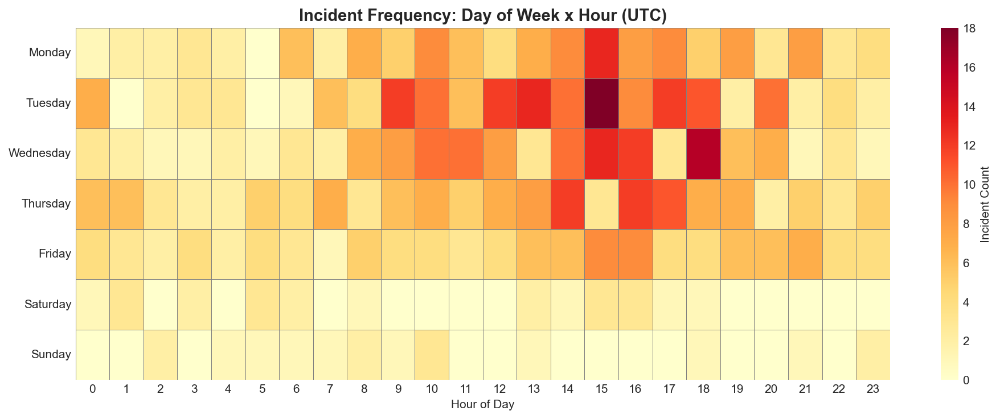
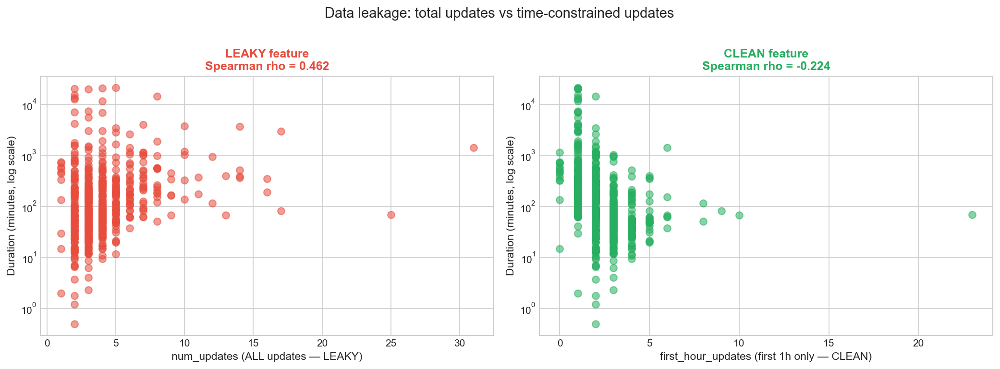

# DSA210 Term Project — Incident Genome

Cloud service outage pattern analysis.

**Course:** DSA210 Introduction to Data Science, Spring 2026
**Author:** Alper Kılıç
**Instructors:** Öznur Taştan, Özgür Asar

## Research question

> Using only features that are observable within the first hour of an incident (service, start-hour, day-of-week, first-hour update count, severity at t=0), can we tell whether an outage will be short (< 60 min) or long (≥ 60 min)?

This repo covers the EDA milestone (milestone1). The supervised classifier comes in milestone2.

## What I did

- Scraped 869 raw incidents from 14 public cloud status pages (GitHub, Cloudflare, OpenAI, Discord, Reddit, Atlassian, Vercel, Netlify, DigitalOcean, Dropbox, Linear, Notion, Twilio, Datadog) via their Statuspage.io API endpoints.
- Cleaned down to 704 resolved incidents with valid duration (dropped 158 unresolved/scheduled-maintenance, 7 with negative duration).
- Flagged 84 outliers with IQR (kept them, didn't drop).
- Built a leakage-free feature `first_hour_updates` (status updates posted within 3600s of incident start) to replace the leaky total `num_updates`.
- 16 figures, 3 hypothesis tests with BH-corrected p-values and effect sizes, bootstrap 95% CI for median duration.

## Key findings

| Question | Result |
|---|---|
| What's a typical outage duration? | median **82.5 min**, bootstrap 95% CI **[73.2, 91.3]** — heavy right tail, mean 480 min |
| Does severity predict first-hour update activity? (H3) | **Yes**. Kruskal-Wallis H=100.6, p≈0, BH-adjusted q≈0, ε²=0.139 (medium effect). Dunn post-hoc: `none` differs from all other groups; `major` vs `minor` also significant. |
| Do business-hours incidents resolve faster? (H1) | **No**. Mann-Whitney U, raw p=0.367, BH q=0.550, Cliff's δ=-0.039 (negligible). |
| Do weekend incidents resolve differently? (H2) | **No**. Mann-Whitney U, raw p=0.878, BH q=0.878, Cliff's δ=-0.015 (negligible). |
| Was the `num_updates`-vs-duration correlation real? | **No**. Leaky version: Spearman ρ≈+0.46. Clean (`first_hour_updates`): Spearman ρ=-0.224 — sign flips and magnitude halves. The original "correlation" was mostly post-resolution updates inflating the count. |
| How imbalanced is the short/long target? | 272 short vs 432 long, 1.59:1 — mild. Stratified split + `class_weight='balanced'` demonstrated in §7a. |





## Instructor-feedback addressed

| Proposal concern | How it's addressed |
|---|---|
| Data leakage | `num_updates` replaced by `first_hour_updates` everywhere hypothesis tests and the heatmap use it. Side-by-side comparison in §10. `impact` and `num_components` also flagged as leaky and excluded from the ML feature set. |
| Outliers | IQR flag kept but not dropped (§2). Day-of-week averages (§5e) exclude flagged outliers. Duration figures use log axes so the tail doesn't dominate. |
| Class imbalance | Visualized in §7 with ratio printout. §7a demonstrates stratified 80/20 split and `compute_class_weight('balanced')` output for the ML milestone. |

## Repo map

| Path | What's inside |
|---|---|
| `eda_report.ipynb` | Main notebook, 14 sections, 29 code cells, all outputs committed |
| `collect_data.py` | Fetches raw incidents from Statuspage.io endpoints, writes JSON to `data/raw/` |
| `data/incidents.json` | All 869 parsed incidents |
| `data/incidents_clean.csv` | 704 resolved + feature-enriched rows (target of milestone1 "featurized" rule) |
| `data/raw/*_raw.json` | Per-service scraped payloads |
| `data/stats.json` | Per-service counts from the last `collect_data.py` run |
| `figures/*.png` | 16 EDA figures |
| `proposal.md`, `proposal.pdf` | Original proposal (frozen) |
| `requirements.txt` | Python deps with minimum version pins |

## How to reproduce

```bash
git clone https://github.com/alperkilic1/dsa210-term-project.git
cd dsa210-term-project
python3 -m venv .venv && source .venv/bin/activate
pip install -r requirements.txt
python collect_data.py           # refreshes data/raw/ and data/incidents.json (~3 min)
jupyter nbconvert --to notebook --execute eda_report.ipynb --output eda_report.ipynb
```

Re-running `collect_data.py` will pull whatever is live on the status pages today — so the incident counts will drift slightly from the committed snapshot. The notebook is set up to run end-to-end in about 30 seconds once `data/incidents.json` exists.

## AI assistance

I used ChatGPT and Claude for: debugging the scraper (HTTP 429 handling, pagination), formatting the proposal document, and double-checking statistical test choices (non-parametric vs parametric, when to use BH vs Bonferroni). All project ideas, data source selection, analysis design, and the leakage fix approach were my own. The notebook text is my wording; where I received a suggestion that I kept, I verified it against a reference (e.g. Tomczak & Tomczak 2014 for epsilon-squared).

## Submission

- Milestone1 is tagged `milestone1` at commit `0b5147f` (push date 2026-04-14).
- All post-tag commits are FINAL-submission work and are on `main`, not under any milestone tag.
