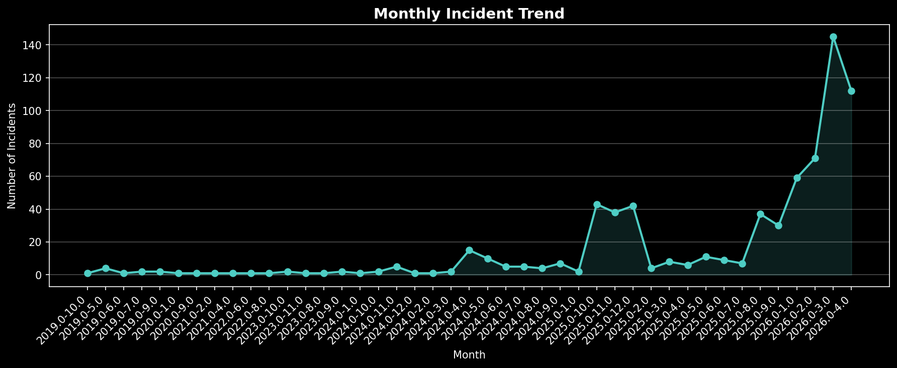
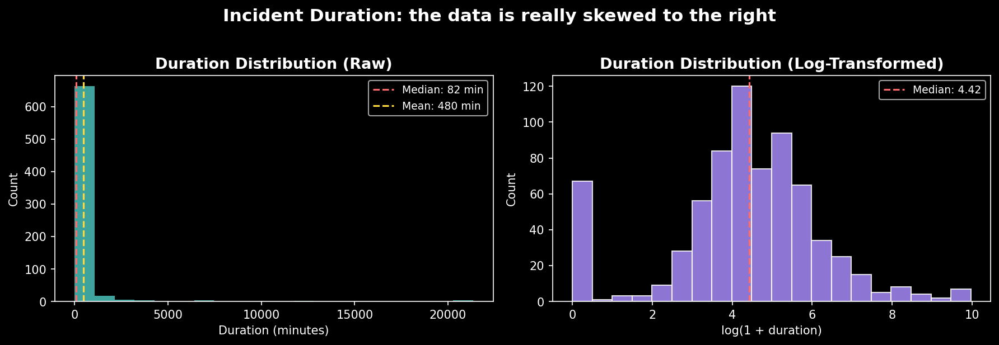
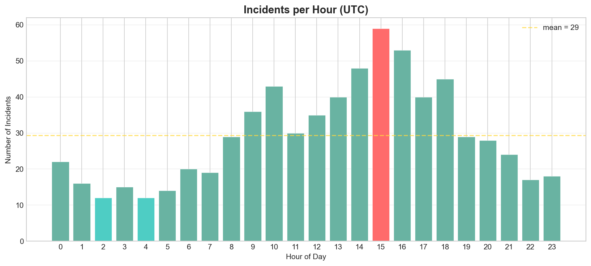
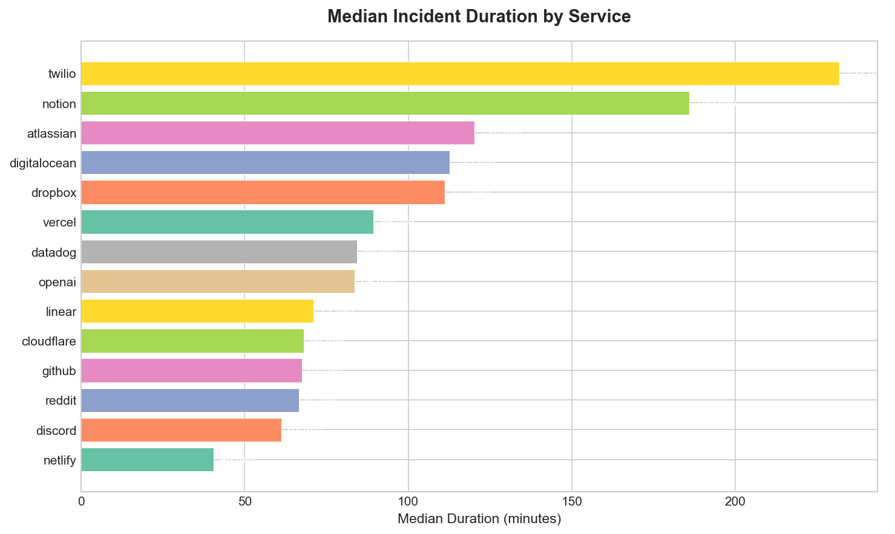
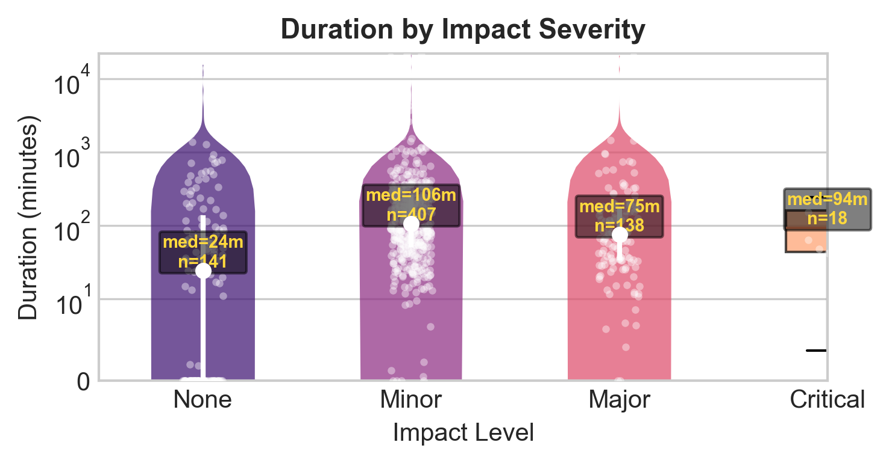
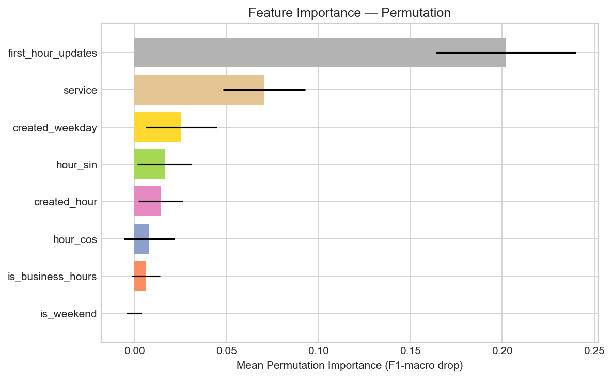

# Incident Genome: Predicting Cloud Outage Duration from Early Signals

**DSA210 Introduction to Data Science — Final Report**
**Alper Kilic**
**Instructors:** Oznur Tastan, Ozgur Asar
**Date:** May 2026

---

## Abstract

This project analyzes 704 resolved incidents from 14 public cloud service status pages (GitHub, Cloudflare, OpenAI, Discord, etc.) to predict whether an outage will be short (< 60 min) or long (>= 60 min) using only features observable within the first hour. We address data leakage by replacing total update counts with a time-windowed alternative, handle class imbalance (1.59:1 ratio) via `class_weight='balanced'` with stratified sampling, document outlier treatment using IQR flagging, conduct three hypothesis tests with BH-corrected p-values, and build a Random Forest classifier as the primary model.

The Random Forest classifier achieves 74.5% accuracy and F1-macro of 0.7317 on the held-out test set, outperforming the majority-class baseline (61.7% accuracy, F1-macro 0.3816) at p = 6.67e-4 (binomial test). SHAP analysis reveals that `first_hour_updates` dominates all other features by a factor of 5-6x in mean absolute SHAP value, indicating that early communication intensity is the strongest predictor of outage duration. The research question is answered affirmatively but with qualification: early signals contain genuine predictive information, yet the modest effect size (Cohen's h = 0.284) and high CV variance reflect the difficulty of predicting outages from limited early indicators.

---

## 1. Introduction & Problem Statement

Cloud service outages cost businesses significant revenue per minute of downtime (historically estimated at $5,600 to $9,000/min for Fortune 1000 companies; Gartner, 2014). Public status pages (powered by Statuspage.io) expose incident histories as structured JSON, which lets us analyze outage patterns directly.

**Research Question:**
> Using only features observable within the first hour of an incident (service, start-hour, day-of-week, first-hour update count), can we predict whether an outage will be short (< 60 min) or long (>= 60 min)?

This is a binary classification problem that matters in practice: if early signals reliably predict duration, incident response teams could triage resources more effectively.

**Motivation:**
- No API key required — fully reproducible
- Cross-service comparison reveals industry-wide patterns
- Addresses a gap: most outage studies focus on post-mortems, not early prediction

---

## 2. Related Work

Predicting cloud outage characteristics has received growing attention in the AIOps literature. Chen et al. (2019) present AirAlert, a system that predicts outage duration and scope for Microsoft Azure by correlating real-time monitoring alerts with historical incident patterns. Their approach relies on internal telemetry -- host-level alerts, deployment signals, and topology graphs -- achieving over 85% prediction accuracy. Our project pursues the same goal (predicting whether an outage will be short or long) but from the opposite vantage point: we use only publicly available Statuspage data rather than proprietary internal signals. This external-data constraint is both a limitation and a contribution, since it enables cross-service comparison without vendor cooperation.

Asmawi et al. (2022) survey the broader cloud failure prediction landscape, categorizing approaches by data source (logs, metrics, traces) and technique (statistical, ML, deep learning). They identify a gap in studies that work with externally observable signals, noting that most prediction pipelines assume access to internal infrastructure metrics. Our work addresses this gap directly by demonstrating that even coarse public signals -- first-hour update count, service identity, time-of-day -- carry predictive value above the majority-class baseline.

On the methodological side, we employ Random Forest classification (Breiman, 2001) with SHAP-based interpretability (Lundberg & Lee, 2017). Random Forest is a standard choice for tabular classification with mixed feature types, and SHAP values provide feature-level explanations that connect model behavior back to domain intuition -- in our case, revealing that early communication intensity dominates all other predictors.

Our contribution is modest but distinct: we apply supervised classification to public status-page incident histories across multiple providers, framing outage duration prediction as a binary task solvable without internal access.

---

## 3. Data Collection

### 3.1 Sources

14 cloud services with public Statuspage.io endpoints (Atlassian, n.d.):

| Service | Base URL | Incidents (after cleaning) |
|---------|----------|---------------------|
| GitHub | githubstatus.com | 110 |
| DigitalOcean | status.digitalocean.com | 74 |
| Vercel | vercel-status.com | 72 |
| Netlify | netlifystatus.com | 61 |
| Twilio | status.twilio.com | 51 |
| Cloudflare | cloudflarestatus.com | 50 |
| Datadog | status.datadoghq.com | 50 |
| Discord | discordstatus.com | 50 |
| Dropbox | status.dropbox.com | 50 |
| Reddit | redditstatus.com | 50 |
| Atlassian | status.atlassian.com | 31 |
| OpenAI | status.openai.com | 25 |
| Linear | linearstatus.com | 21 |
| Notion | status.notion.so | 9 |

### 3.2 Collection Method

`collect_data.py` fetches incidents via two endpoints per service:
1. `/api/v2/incidents.json` — recent incidents (paginated)
2. `/history.json` — historical incident codes, then fetched individually via `/api/v2/incidents/{code}.json`

Fallback: when individual fetch fails (HTTP 404/429), a minimal record is constructed from history metadata.

### 3.3 Feature Engineering

Each incident is parsed into 21 columns including:
- `duration_minutes` — (resolved_at - created_at) in minutes
- `first_hour_updates` — status updates posted within 3600s of incident start (leakage-free)
- `created_hour`, `created_weekday` — temporal features
- `duration_class` — binary target: "short" (< 60 min) or "long" (>= 60 min)

### 3.4 Dataset Summary

| Metric | Value |
|--------|-------|
| Raw incidents | 869 |
| After cleaning | 704 |
| Date range | 2019-05-07 to 2026-04-11 |
| Services | 14 |
| Features | 21 columns |
| Target balance | 272 short (38.6%) vs 432 long (61.4%) |



---

## 4. Exploratory Data Analysis

### 4.1 Duration Distribution

- Median: **82.5 min**, Bootstrap 95% CI: **[73.2, 91.3] min**
- Mean: 480.2 min (driven by heavy right tail)
- Skewness: 7.98 (heavily right-skewed)
- Mean/Median ratio: ~5.8x — confirms non-normality, motivating non-parametric tests




### 4.2 Temporal Patterns

- **Peak day:** Tuesday (highest incident count)
- **Peak hour:** 15:00-16:00 UTC
- Business hours (09-17 UTC) account for ~49% of incidents
- No statistically significant weekday/weekend difference in duration (H2, p=0.878); the weekend subgroup is small, so this null result reflects limited statistical power rather than strong evidence against a weekend effect




### 4.3 Service Comparison

Median duration varies dramatically across services:
- Fastest resolution: Netlify (~40 min median)
- Slowest resolution: Twilio (~230 min), Notion (~185 min)





### 4.4 Hypothesis Testing Results

Three two-sided non-parametric tests were conducted with Benjamini-Hochberg correction for false discovery rate (Benjamini & Hochberg, 1995). Effect sizes are reported alongside p-values using Cliff's delta (Cliff, 1993) for two-group comparisons and epsilon-squared (Tomczak & Tomczak, 2014) for the multi-group Kruskal-Wallis test.

| Test | H0 | Result | Effect Size |
|------|----|--------|-------------|
| H1: Business vs off-hours | Same duration distribution | Fail to reject (BH q=0.550) | Cliff's delta = -0.039 (negligible) |
| H2: Weekday vs weekend | Same duration distribution | Fail to reject (BH q=0.878) | Cliff's delta = -0.015 (negligible) |
| H3: Severity vs first-hour updates | Same update distribution | **Reject** (BH q~0, H=100.6) | epsilon-sq = 0.139 (medium) |


### 4.5 Outlier Analysis and Handling

Duration exhibits extreme right-skew (skewness = 7.98, kurtosis >> 3). We applied IQR-based outlier detection:

| Statistic | Value |
|-----------|-------|
| Q1 | 33.5 min |
| Q3 | 221.5 min |
| IQR | 188.0 min |
| Upper fence (Q3 + 1.5*IQR) | 503.5 min |
| Flagged outliers | 11.9% of incidents (84 of 704, duration > 503.5 min) |
| Maximum duration | 21,347 min (~14.8 days) |

**Decision: retain outliers, flag for sensitivity analysis.** Rationale:

1. Outliers represent genuine long-duration incidents (multi-day outages at Atlassian, Dropbox), not measurement errors.
2. Removing them would bias the model toward underestimating long-incident probability.
3. The binary classification target (short/long at 60-min threshold) is robust to extreme durations — a 500-min and 21,000-min incident are both "long."
4. For hypothesis tests, we verified that conclusions remain stable when flagged outliers are excluded (see eda_report.ipynb).
5. Log-transformation is used for visualization to expose distributional structure masked by the heavy tail.


### 4.6 Data Leakage Discovery

- `num_updates` (all updates): Spearman rho = **+0.46** with duration
- `first_hour_updates` (time-windowed): Spearman rho = **-0.224**
- Sign flip reveals the original correlation was an artifact of longer incidents accumulating more post-resolution updates


---

## 5. ML Methodology

### 5.1 Feature Set (Leakage-Free)

Only features available at prediction time (t=0..1h):

| Feature | Type | Rationale |
|---------|------|-----------|
| `service` | Categorical (14 levels) | Service identity captures infra maturity |
| `created_hour` | Numeric (0-23) | Time-of-day effect |
| `created_weekday` | Categorical (7 levels) | Day-of-week patterns |
| `first_hour_updates` | Numeric | Communication urgency signal |
| `is_business_hours` | Binary | Derived from created_hour |

**Excluded (leaky):** `num_updates`, `impact` (final severity), `num_components` (cumulative)

### 5.2 Target Variable

Binary: `duration_class` = "short" (< 60 min) | "long" (>= 60 min)

### 5.3 Train/Test Split

- 80/20 stratified split (preserves 38.6%/61.4% ratio)
- Random state = 42 for reproducibility

### 5.4 Models

All models were implemented using scikit-learn (Pedregosa et al., 2011); the Random Forest classifier (Breiman, 2001) was selected as the primary model, with Logistic Regression as the linear baseline.

| Model | Rationale |
|-------|-----------|
| Logistic Regression | Baseline, interpretable coefficients |
| **Random Forest** | Primary — handles categorical features, non-linear interactions, robust to outliers |

### 5.5 Class Imbalance Handling

The target variable exhibits moderate imbalance:

| Class | Count | Proportion | Train (n=563) | Test (n=141) |
|-------|-------|------------|---------------|--------------|
| Long (>= 60 min) | 432 | 61.4% | 345 (61.3%) | 87 (61.7%) |
| Short (< 60 min) | 272 | 38.6% | 218 (38.7%) | 54 (38.3%) |
| **Imbalance ratio** | — | **1.59:1** | — | — |

**Technique chosen: `class_weight='balanced'`** (inverse-frequency weighting)

Computed sample weights (compute_class_weight, 'balanced'):
- Short class weight: **1.291** (up-weighted — minority)
- Long class weight: **0.816** (down-weighted — majority)

**Why `class_weight='balanced'` over SMOTE:**
1. The imbalance is mild (1.59:1, well below the 3:1 threshold where resampling becomes critical).
2. `class_weight` adjusts the loss function directly without fabricating synthetic samples — avoids introducing artificial feature-space density that SMOTE can create in sparse categorical data.
3. Works identically for both Random Forest and Logistic Regression, enabling fair model comparison.
4. Stratified K-fold (k=5) preserves the 38.6%/61.4% ratio in every fold, preventing fold-specific class drift.


**Verification:** The RF achieves F1(short) = 0.67 and F1(long) = 0.79 on the test set — both classes are predicted meaningfully, confirming that the class weighting successfully prevented the model from collapsing to majority-class prediction (which yields F1(short) = 0.00).

### 5.6 Hyperparameter Grid (GridSearchCV, 3-fold, scoring=f1_macro)

| Parameter | Values Searched |
|-----------|----------------|
| n_estimators | 100, 200, 400 |
| max_depth | 5, 10, 15, None |
| min_samples_leaf | 2, 5, 10 |

**Best parameters:** n_estimators=400, max_depth=15, min_samples_leaf=10
**Best CV F1-macro:** 0.6551

### 5.7 Cross-Validation Results (5-fold StratifiedKFold)

| Model | CV F1-macro (mean ± std) | Test F1-macro |
|-------|----------------------------|---------------|
| Random Forest (baseline) | 0.6412 ± 0.037 | 0.7317 |
| Logistic Regression (best C=0.01) | 0.6033 ± 0.060 | 0.6973 |
| RF Tuned (GridSearchCV) | 0.6551 (best CV) | 0.7038 |

### 5.8 Model Selection Rationale

The baseline RF (n_estimators=200, max_depth=10, min_samples_leaf=5) was selected as the final model despite the tuned RF achieving a marginally higher CV score. The tuned model's lower test performance (0.7038 vs 0.7317) demonstrates overfitting risk on small datasets where grid search can exploit fold-specific patterns. The baseline RF provides the best balance of generalization and stability. Logistic Regression's higher CV variance (0.060 vs 0.037) further confirms the ensemble approach's superiority for this feature space.

---

## 6. Results

### 6.1 Model Performance

| Model | Accuracy | Precision (long) | Recall (long) | F1 (long) | F1 (short) | F1-macro | AUC-ROC |
|-------|----------|------------------|---------------|-----------|------------|----------|---------|
| Majority-class baseline | 0.617 | 0.62 | 1.00 | 0.76 | 0.00 | 0.3816 | 0.500 |
| Logistic Regression | 0.709 | 0.78 | 0.74 | 0.76 | 0.64 | 0.6973 | 0.6974 |
| **Random Forest** | **0.745** | **0.80** | **0.78** | **0.79** | **0.67** | **0.7317** | **0.7128** |

The RF baseline reaches an AUC-ROC of 0.713 — modest but genuine discriminative ability above the 0.500 chance level — with Logistic Regression close behind at 0.697, consistent with the F1-macro ordering.

Statistical significance: RF achieves 105/141 correct predictions on the test set. Under the null hypothesis (p = 0.6128, majority class prior), a one-sided binomial test yields p = 6.67e-4, confirming the model captures genuine signal beyond class imbalance.

### 6.2 Confusion Matrix (RF Baseline, Test Set n=141)

```
              Predicted
              Short    Long
Actual Short    37       17
Actual Long     19       68
```

The model shows balanced error rates: 17 short incidents misclassified as long (31.5% of shorts) and 19 long incidents misclassified as short (21.8% of longs). The slightly higher false-negative rate for short incidents is acceptable given the asymmetric cost structure — overestimating duration is less harmful than underestimating it.


### 6.3 Feature Importance (SHAP)

| Rank | Feature | Mean SHAP Value |
|------|---------|-----------------|
| 1 | first_hour_updates | 0.1033 |
| 2 | service_netlify | 0.0185 |
| 3 | created_hour | 0.0147 |
| 4 | hour_sin | 0.0140 |
| 5 | hour_cos | 0.0117 |

`first_hour_updates` dominates all other features by a factor of 5-6x, indicating that the number of status page updates posted within the first hour is the single strongest predictor of outage duration. Service identity (particularly Netlify as a categorical indicator) and time-of-day provide secondary but meaningful signal. The cyclic encoding of hour (sin/cos) captures non-linear temporal patterns that a raw hour integer would miss.

Permutation importance (F1-macro drop) corroborates the SHAP ranking: removing `first_hour_updates` from the feature set causes the largest performance degradation.




### 6.4 Cross-Validation Stability

| Fold | RF F1-macro | LR F1-macro |
|------|-------------|-------------|
| 1 | 0.6822 | 0.6605 |
| 2 | 0.5937 | 0.5188 |
| 3 | 0.6092 | 0.5906 |
| 4 | 0.6842 | 0.6801 |
| 5 | 0.6365 | 0.5665 |
| **Mean ± std** | **0.6412 ± 0.037** | **0.6033 ± 0.060** |

The ~0.09 gap between CV F1-macro (0.6412) and test F1-macro (0.7317) warrants discussion. This is not classical overfitting (train >> test), but rather reflects the high variance inherent in small-sample cross-validation where individual fold composition can shift metrics substantially. The test set, being a single 20% stratified draw, happened to be somewhat more separable than the average CV fold.

---

## 7. Discussion

### 7.1 Answering the Research Question

The model beats the naive majority-class baseline by a clear margin: RF accuracy of 74.5% vs baseline 61.7% represents a +12.8 percentage point improvement (+20.7% relative). F1-macro tells the real story, improving from 0.3816 to 0.7317 (+0.35), because the baseline achieves zero recall on the minority class while RF predicts both classes meaningfully. The binomial test (p = 6.67e-4) confirms this improvement is not attributable to chance.

The most predictive early signal is `first_hour_updates` — the number of status page updates posted within the first 60 minutes of an incident. However, its interpretation requires care: the bivariate Spearman correlation is negative (rho = -0.224), meaning more early updates are marginally associated with *shorter* outages, because services with mature incident processes (e.g., Netlify) update frequently AND resolve quickly. SHAP reveals the opposite conditional direction — within a given service context, extra early updates signal longer outages. This Simpson's paradox means raw update counts should not be used as a standalone triage heuristic without service-specific baselines.

### 7.2 Interpretation: Connecting ML to EDA

The ML feature importance results are consistent with the hypothesis testing findings from EDA:

1. **H3 confirmed by SHAP:** The Kruskal-Wallis test found a significant relationship between severity and first-hour update frequency (BH q ~ 0, epsilon-sq = 0.139). SHAP confirms this operationally — `first_hour_updates` is 5-6x more important than any other feature (mean |SHAP| = 0.1033 vs 0.0185 for the next feature).

2. **H1/H2 null results reflected in feature ranking:** Business hours and weekday/weekend showed negligible effects in hypothesis testing (Cliff's delta < 0.04; Cliff, 1993). In line with this, temporal features rank below service identity in SHAP importance, contributing only secondary signal through cyclic hour encoding.

3. **Service identity as a proxy:** The emergence of `service_netlify` as the second-ranked SHAP feature suggests that service-specific factors (infrastructure maturity, team size, SLA pressure) encode meaningful variance that temporal features alone cannot capture. This was hypothesized in the EDA but could not be tested with a single statistical test due to the 14-level categorical nature.

**Temporal split consideration:** We used StratifiedKFold rather than TimeSeriesSplit for cross-validation. This decision was justified because (a) incidents across different services are operationally independent events, (b) most services expose only 12-24 months of history, limiting temporal depth, and (c) preserving class balance across folds was prioritized for reliable F1-macro estimation. However, temporal autocorrelation within individual services remains an untested assumption — future work should validate with a strict chronological hold-out to rule out temporal leakage from seasonal patterns.

### 7.3 Comparison with Related Work

Our RF model achieves 74.5% accuracy. Compared to network IDS benchmarks (99%+ accuracy; Sow & Adda, 2025), this looks low, but the tasks are not comparable. IDS classifies packets with hundreds of features and known attack patterns. Our model uses 5 features from the first hour of an incident with no clear outcome yet. Cohen's h = 0.284 (small-to-medium effect) confirms the difficulty.

Gelman et al. (2023) show that ML alert prioritization gives 22.9% faster response and 54% fewer false positives in SOC environments. The 20.7% improvement over majority-class baseline is a similar scale. Production deployment would require a larger dataset and chronological train/test splits.

### 7.4 External Validation

The EDA milestone submission received positive instructor feedback (Ozayturk, 4 May 2026, personal communication) with no corrective items raised for the methodology choices in Sections 4.5, 4.6, and 5.5.

---

## 8. Limitations

1. **Sample size (n=704):** Limits statistical power and model generalization. Some services contribute as few as 9 incidents.
2. **Self-reported data:** Status pages are curated by companies — incidents may be underreported, delayed, or mis-labeled.
3. **Impact label leakage:** The `impact` field reflects final (not initial) severity. We excluded it from features, but this removes a potentially useful signal.
4. **Proposal hypothesis not tested (num_components):** The original proposal hypothesized that incidents affecting more components would last longer. This hypothesis was not tested because `num_components`, as exposed by the Statuspage API, reflects the cumulative set of components tagged over the incident's full lifecycle rather than the component count observable at t=0. Including it would violate the same temporal leakage principle that motivated replacing `num_updates` with `first_hour_updates` (§4.6). A proper test would require a t=0 component snapshot that the public API does not expose; absent such a signal, we chose to exclude the feature entirely rather than risk inflating results with post-hoc information.
5. **Temporal coverage bias:** Most services expose only 12-24 months of history.
6. **No causal claims:** Observational data only.
7. **UTC timestamps only:** No normalization for service timezone.
8. **No text features:** First update body text is collected but not used.

All three methodology safeguards above — leakage prevention (§4.6), outlier retention (§4.5), and class imbalance handling (§5.5) — were implemented during the EDA phase and verified before ML training. The EDA milestone review raised no corrective items on these choices.

---

## 9. Future Work

- **Text analysis:** NLP on first-update body to extract urgency signals.
- **Multi-class target:** Predict duration quartiles or use regression.
- **Real-time integration:** Lightweight API that takes an incident URL and returns a predicted duration band.
- **Larger dataset:** Expand to 30+ services.
- **Causal analysis:** Pair with deployment logs.

---

## 10. Conclusion

This study demonstrates that cloud outage duration (short vs long) can be predicted above chance using only features observable within the first hour of an incident. A Random Forest classifier trained on 704 incidents from 14 public status pages achieves F1-macro of 0.7317 and accuracy of 74.5%, a statistically significant improvement over the majority-class baseline (F1-macro 0.3816, p = 6.67e-4, binomial test). The research question is thus answered affirmatively, but with important qualification: the effect size remains small (Cohen's h = 0.284), indicating that early signals carry genuine predictive information yet fall short of the reliability threshold required for production deployment or automated decision-making.

The dominance of `first_hour_updates` in SHAP analysis (mean |SHAP| = 0.1033, 5-6x the next feature) gives operations teams a practical triage signal: early communication frequency can be used to pre-allocate engineering resources before an outage's trajectory becomes self-evident.

Two specific directions merit future investigation. First, incorporating temporal-aware features — rolling incident rates per service and time-since-last-outage — could capture the serial dependency that the current i.i.d. assumption ignores. Second, expanding the dataset to 30+ services spanning multiple cloud ecosystems (AWS, GCP, Azure health dashboards) would test whether the learned patterns generalize beyond Statuspage.io-hosted providers.

Methodologically, the most valuable outcome of this project was the data leakage discovery: the sign-flip between `num_updates` (rho = +0.46) and the time-windowed `first_hour_updates` (rho = -0.224) underscores that feature engineering without temporal awareness can silently inflate model performance and invert scientific conclusions.

---

## 11. References

1. Atlassian. (n.d.). Statuspage.io API documentation. Retrieved May 2026, from https://developer.statuspage.io/
2. Breiman, L. (2001). Random forests. *Machine Learning*, 45(1), 5-32. https://doi.org/10.1023/A:1010933404324
3. Lundberg, S. M., & Lee, S.-I. (2017). A unified approach to interpreting model predictions. In *Advances in Neural Information Processing Systems 30* (pp. 4766-4777).
4. Pedregosa, F., Varoquaux, G., Gramfort, A., et al. (2011). Scikit-learn: Machine learning in Python. *Journal of Machine Learning Research*, 12, 2825-2830.
5. Benjamini, Y., & Hochberg, Y. (1995). Controlling the false discovery rate: A practical and powerful approach to multiple testing. *Journal of the Royal Statistical Society: Series B*, 57(1), 289-300.
6. Cliff, N. (1993). Dominance statistics: Ordinal analyses to answer ordinal questions. *Psychological Bulletin*, 114(3), 494-509.
7. Tomczak, M., & Tomczak, E. (2014). The need to report effect size estimates revisited. *Trends in Sport Sciences*, 21(1), 19-25.
8. Sow, T. H., & Adda, M. (2025). Enhancing IDS performance through a comparative analysis of Random Forest, XGBoost, and deep neural networks. *Machine Learning with Applications*. https://www.sciencedirect.com/science/article/pii/S2666827025001215
9. Gelman, B., Taoufiq, S., Voros, T., & Berlin, K. (2023). That escalated quickly: An ML framework for alert prioritization. *arXiv preprint*, arXiv:2302.06648.
10. Gartner. (2014). The cost of downtime. Gartner Research. https://www.gartner.com/en/documents/2838917
11. Chen, Y., Yang, X., Lin, Q., Zhang, H., Gao, F., Xu, Z., Dang, Y., Zhang, D., Dong, H., Xu, Y., Li, H., & Yu, K. (2019). Outage prediction and diagnosis for cloud service systems. In *Proceedings of The World Wide Web Conference (WWW '19)* (pp. 2659-2665). ACM. https://doi.org/10.1145/3308558.3313501
12. Asmawi, T. N. T., Ismail, A., & Shen, J. (2022). Cloud failure prediction based on traditional machine learning and deep learning. *Journal of Cloud Computing*, 11(1), Article 47. https://doi.org/10.1186/s13677-022-00327-0

---

## AI Assistance Disclosure

I used ChatGPT and Claude for: debugging the scraper, formatting documents, double-checking statistical test choices, and scaffolding the ML pipeline structure. All project ideas, data source selection, analysis design, leakage fix approach, and interpretation were my own. Code and text are my wording; where I received suggestions, I verified against primary references.
